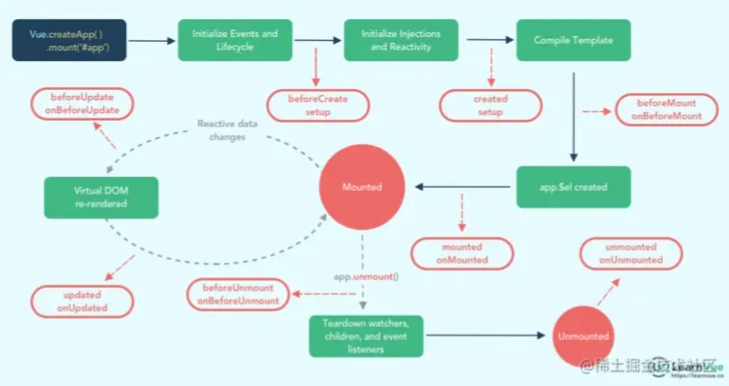

# vue的生命周期以及作用

## vue2生命周期

* **beforeCreate** 是 new Vue() 之后触发的第一个钩子，在当前阶段data、methods、computed以及watch上的数据和方法都不能被访问  
* **created** 在实例创建完成后发生，当前阶段 **已经万册灰姑娘了数据观测**，也就是可以使用数据、更改数据，在这里更改数据 **不会触发updated函数**。可以做一些初始数据的获取，在当前阶段**无法与DOM进行交互**，如果非要想，可以通过`vm.$nextTick`来访问DOM  
* **beforeMount** 发生在挂载之前，在这之前template模板已导入渲染函数编译。而当前阶段虚拟DOM已经创建完成，即将开始渲染。在此时也可以对数据进行修改，不会触发updated
* **mounted** 在挂载完成后发生，在当前阶段，真是DOM挂载完毕，数据完成双向绑定，可以访问DOM节点，使用 $refs 属性对DOM进行操作  
* **beforeUpdate** 发生在更新之前，也就是响应式数据发生更新，虚拟dom重新渲染之前被触发，你可以在当前阶段进行更改数据，不会造成重渲染。  
* **updated** 发生在更新完成之后，当前阶段组件Dom已完成更新。要注意的是避免在此期间更改数据，因为这可能会导致无限循环的更新。  
* **beforeDestroy** 发生在实例销毁之前，在当前阶段实例完全可以被使用，我们可以在这时进行善后收尾工作，比如清除计时器。  
* **destroyed** 发生在实例销毁之后，这个时候只剩下了dom空壳。组件已被拆解，数据绑定被卸除，监听被移出，子实例也统统被销毁。  

## vue3生命周期

* **onBeforeMount** – 在挂载开始之前被调用：相关的 `render` 函数首次被调用
* **onMounted** – 组件挂载时调用
* **onBeforeUpdate** – 数据更新时调用，发生在虚拟 DOM 打补丁之前。这里适合在更新之前访问现有的 DOM，比如手动移除已添加的事件监听器。
* **onUpdated** – 由于数据更改导致的虚拟 DOM 重新渲染和打补丁，在这之后会调用该钩子。
* **onBeforeUnmount** – 在卸载组件实例之前调用。在这个阶段，实例仍然是完全正常的。
* **onUnmounted** – 卸载组件实例后调用。调用此钩子时，组件实例的所有指令都被解除绑定，所有事件侦听器都被移除，所有子组件实例被卸载
* **onActivated** – 被 `keep-alive` 缓存的组件激活时调用。**这个钩子在服务器端渲染期间不会被调用** 
* **onDeactivated** – 被 `keep-alive` 缓存的组件停用时调用。**这个钩子在服务器端渲染期间不会被调用** 
* **onErrorCaptured** – 注册一个钩子，在捕获了后代组件传递的错误时调用。
* **onRenderTracked** – 注册一个调试钩子，当组件渲染过程中追踪到响应式依赖时调用。**这个钩子仅在开发模式下可用，且在服务器端渲染期间不会被调用**
* **onRenderTriggered** – 注册一个调试钩子，当响应式依赖的变更触发了组件渲染时调用。**这个钩子仅在开发模式下可用，且在服务器端渲染期间不会被调用**
* **onServerPrefetch** – 仅在服务端渲染期间使用，用于注册一个异步函数，在组件实例在服务器上被渲染之前调用。可用于在服务器上请求后台接口数据，它比在客户端上请求后台数据更快。

## vue2更到vue3

* beforeCreate` -> 使用 `setup()
* created` -> 使用 `setup()
* beforeMount` -> `onBeforeMount
* mounted` -> `onMounted
* beforeUpdate` -> `onBeforeUpdate
* updated` -> `onUpdated
* beforeDestroy` -> `onBeforeUnmount
* destroyed` -> `onUnmounted
* errorCaptured` -> `onErrorCaptured

